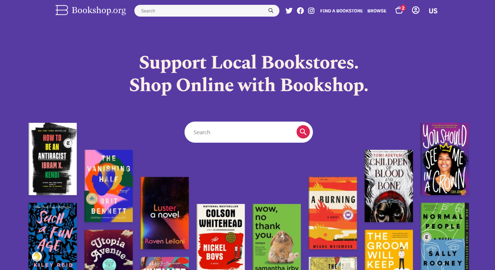

# bookstore-mearnstack
URL: https://bookstore-mearnstack.vercel.app/



## Table of contents
* [General info](#general-info)
* [Technologies](#technologies)
* [Setup](#setup)

## General info
This project is a Mearnstack Webapp for Ecommerce Bookstore

## Technologies
Project is created with:
Backend: ExpressJS
Content Management: React Admin
Frontend: Nextjs
	
## Setup
To run this project, install it locally using:

```
$ git clone https://github.com/donga2606/bookstore-mearnstack
$ npm install
$ npm start
```
